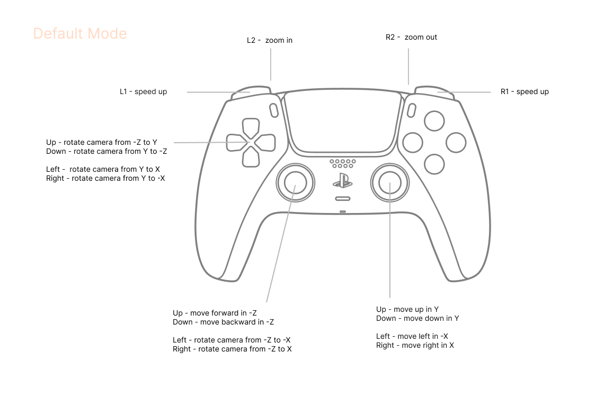

## Lagopus in Calcit

> tiny tool for drawing 3D shapes with WebGPU, wraps on [Lagopus.ts](https://github.com/Triadica/lagopus.ts).

- Demo https://r.tiye.me/Triadica/lagopus/
- Boilerplate https://github.com/Triadica/lagopus-workflow


### APIs

```cirru
:lagopus.alias :refer $ object

object $ {}
  :shader demo-wgsl
  :topology :triangle-list
  :attrs-list $ []
    :: :float32x3 :position
    :: :float32x3 :color
  :data $ []
    :: :vertex (v3 0 0 0) (v3 1 0 0)
    :: :vertex (v3 100 0 0) (v3 0 1 0)
    :: :vertex (v3 0 100 0) (v3 0 0 1)
```

- `:shader` custom shader file string
- `:topology` topology symbol, `:triangle-list` or `:line-strip`
- `:attrs-list` list of attributes, first value providing type, second value is a name(history reason...)
- `:data` list of data, each data is a map with keys matching `:attrs-list`, nested list is supported
- optional `:indices` list of indices, each index is a number. nested list is supported
- `:get-params`, to add custom params with `uniform` buffer, for example `fn () (js-array 1 1 1 1)`, notice the values should obey [memory alignments](https://sotrh.github.io/learn-wgpu/showcase/alignment/#alignment-of-uniform-and-storage-buffers)

Alternatively, there's also `object-writer` which provides a writer API, which replaces `:data`:

```cirru
  :writer $ fn (write!)
    write! $ []
      :: :vertex (v3 1 1 1)
```

### Shader

Shader file expects 3 parts:

- params(could be empty)
- `vertex_main`, here you call `transform_perspective` to display point in 3d
- `fragment_main`

```wgsl
// to include `lagopus-perpective.wgsl` , provide function `transform_perspective`
#import lagopus::perspective

struct Params {
  _t: f32,
}

@group(0) @binding(0) var<uniform> params: Params;

// structure passing from Vertex to Fragment
struct VertexOut {
  @builtin(position) position: vec4f,
};

@vertex
fn vertex_main(
  @location(0) position: vec3f,
  // data added from attributes put here
) -> VertexOut {
  var output: VertexOut;
  let p = transform_perspective(position.xyz).point_position;
  let scale: f32 = 0.002;

  output.position = vec4(p.xyz * scale, 1.0);
  return output;
}

@fragment
fn fragment_main(vtx_out: VertexOut) -> @location(0) vec4f {
  return vec4f(0.0, 0.0, 0.0, 1.0);
}
```

##### Builtin functions

`#import lagopus::perspective`

- `fn transform_perspective(p: vec3f) -> PointResult`

`#import lagopus::colors`

- `fn hsl2rgb(hsl: vec3f) -> vec3f`
- `fn hsl(h: f32, s: f32, l: f32) -> vec3f`

`#import lagopus::rand`

- `fn rand(n: f32) -> f32`
- `fn rand_balanced(n: f32) -> f32`
- `fn noise(p: f32) -> f32`
- `fn rand2(n: vec2<f32>) -> f32`
- `fn noise2(n: vec2<f32>) -> f32`

`#import lagopus::simplex`

- `fn simplexNoise2(v: vec2<f32>) -> f32`

`#import lagopus::hsluv`

- `fn hsluvToRgb(tuple: vec3f) -> vec3f` based on 360 and 100

### Components

##### Curves

```cirru
lagopus.comp.curves :refer $ comp-curves comp-polylines break-mark

comp-curves $ {} (; :topology :line-strip)
  :curves $ []
    -> (range 400)
      map $ fn (idx)
        let
            angle $ * 0.1 idx
            r 40
          {}
            :position $ []
              * r $ cos angle
              * 0.6 idx
              * r $ sin angle
            :width 2
```

Another way of defining lines is `comp-polylines` that seperate segments with `:: :break`s.
It does not require "flatterned" list so is supposed to be a little performant.

> note that `: vertex p` is a short form for `:: :vertex p` since Calcit `0.7.2` .

```cirru
comp-polylines $ {} (; :topology :line-strip)
  :writer $ fn $ (write!)
    write! $ []
      : vertex ([] 0 0 0) width
      : vertex ([] 100 100 0) width
      , break-mark
      : vertex ([] 0 0 10) width
      : vertex ([] 200 0 10) width
      : vertex ([] 200 20 0) width
      : vertex ([] 100 40 0) width
      : vertex ([] 100 20 200) width
      , break-mark
```

also if you want an extra mark for controlling colors:

```cirru
comp-polylines-marked $ {} (; :topology :line-strip)
  :writer $ fn (write!)
    write! $ []
      : vertex ([] 0 0 0) width 0
      : vertex ([] 100 100 0) width 0
      , break-mark
      : vertex ([] 0 0 10) width 2
      : vertex ([] 200 0 10) width 2
      : vertex ([] 200 20 0) width 2
      : vertex ([] 100 40 0) width 2
      : vertex ([] 100 20 200) width 2
      , break-mark
```

##### Spots

```cirru
lagopus.comp.spots :refer $ comp-spots comp-bubbles

comp-spots $ {} (; :topology :line-strip)
  :radius 6
  :vertex-count 8
  :shift 12
  :points $ -> (range 80)
    map $ fn (idx)
      let
          r $ * idx 4
        [] r
          * r $ cos (* 0.1129 idx)
          * r $ sin (* 0.123 idx)

comp-bubbles $ {}
  :bubbles $ -> (range 600)
    map $ fn (idx)
      [] (rand-shift 0 area) (rand-shift 0 area) (rand-shift 0 area) (+ 6 $ rand 120)
```

##### Axis

```cirru
laopus.comp.curves :refer $ comp-axis

comp-axis $ {} (:n 20)
  :unit 20
```

##### Cube

```cirru
lagopus.comp.cube :refer $ comp-cube

comp-cube $ {}
  :position $ [] 40 0 0
  :radius 40
```

##### Sphere

```cirru
lagopus.comp.sphere :refer $ comp-sphere

comp-sphere $ {} (; :topology :line-strip)
  :iteration 4
  :radius 160
```

##### Plate

```cirru
lagopus.comp.plate :refer $ comp-plate

comp-plate $ {} (; :topology :line-strip)
  :iteration 20
  :radius 160
  :color $ [] 0.04 0.8 0.6
  :transformer $ fn (i)
    v+ i $ [] 0 0 -10
  ; :x-direction $ [] 1 0 0
  ; :y-direction $ [] 0 1 0
  :chromatism 0.14
```

##### Controls

```cirru
lagopus.comp.button :refer $ comp-button comp-slider comp-drag-point

comp-button
  {}
    :position $ [] 240 260 0
    :color $ [] 0.2 0.9 0.6 1
    :size 20
  fn (e d!)
    d! :tab :sphere

comp-slider
  {} $ :position ([] 0 0 0)
  fn (change on-slide)
    js/console.log "\"Slide" change

comp-drag-point
  {}
    :position $ :pos state
    :color $ [] 0.6 0.6 1.0 1.0
  fn (move d!)
    d! cursor $ assoc state :pos move
```

##### Stitch

```cirru
lagopus.comp.stitch :refer $ comp-stitch

comp-stitch $ {}
  :chars $ [] 0xf2dfea34 0xc3c4a59d 0x88737645
  :position $ [] 0 0 0
```

### Cursor

```cirru
lagopus.cursor :refer $ update-states >>
```

Math functions in `lagopus.math`

- `fibo-grid-range total` create a list of points constructing Fibonacci Sphere
- `rotate-3d origin axis-0 angle p` rotate point `p` around `axis-0`
- `rotate-3d origin axis-0 angle` create a function to rotate point p

### Gamepad Controls



### Resources

Shader functions from https://gist.github.com/munrocket/236ed5ba7e409b8bdf1ff6eca5dcdc39

### License

MIT
